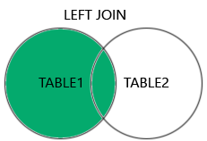

# MySQL 目錄

- MySQL is open-source
- MySQL is free
- MySQL is developed, distributed, and supported by Oracle Corporation

- RDBMS is RDBMS stands for Relational Database Management System.
- RDBMS is a program used to maintain a relational database.
- RDBMS is the basis for all modern database systems such as MySQL, Microsoft SQL Server, Oracle, and Microsoft Access. [website](https://www.w3schools.com/mysql/mysql_rdbms.asp)

| 項目               | 連結                             |
|--------------------|----------------------------------|
| [mysql 基本介紹]    | [#mysql](#mysql)                 |
| [mysql sql 語法總覽] | [#mysql-sql](#mysql-sql)         |
| [select 基本語法]    | [#select](#select)               |
| [where 條件查詢]     | [#where](#where)                 |
| [and, or 和 not 操作符] | [#and-or-and-not-operators](#and-or-and-not-operators) |
| [排序]              | [#order-by](#order-by)           |
| [插入資料]          | [#insert-into](#insert-into)     |
| [null 值]           | [#null](#null)                   |
| [更新資料]          | [#update](#update)               |
| [刪除資料]          | [#delete](#delete)               |
| [限制]              | [#limit](#limit)                 |
| [最小值與最大值]     | [#min-and-max](#min-and-max)     |
| [計數、平均值與總和] | [#count,-avg,-sum](#count,-avg,-sum) |
| [like 條件]         | [#like](#like)                   |
| [通配符 (wildcards)] | [#wildcards](#wildcards)         |
| [in 條件]           | [#in](#in)                       |
| [between 條件]      | [#between](#between)             |
| [別名]              | [#aliases](#aliases)             |
| [連接]              | [#joins](#joins)                 |
| [內部連接]          | [#inner-join](#inner-join)       |
| [左連接]            | [#left-join](#left-join)         |
| [右連接]            | [#right-join](#right-join)       |
| [交叉連接]          | [#cross-join](#cross-join)       |
| [自我連接]          | [#self-join](#self-join)         |
| [聯合]              | [#union](#union)                 |
| [分組]              | [#group-by](#group-by)           |
| [having]            | [#having](#having)               |
| [exists]            | [#exists](#exists)               |
| [any, all]          | [#any-and-all](#any-and-all)     |
| [插入選擇]          | [#insert-select](#insert-select) |
| [條件表達式]        | [#case](#case)                   |
| [null 函數]         | [#ifnull](#ifnull)               |
|--------------------|----------------------------------|
| [註解]              | [#comments](#comments)           |
| [運算子]            | [#operators](#operators)         |
| [資料庫]            | [#database](#database)           |
| [建立資料庫]        | [#create-db](#create-db)         |
| [刪除資料庫]        | [#drop-db](#drop-db)             |
| [建立資料表]        | [#create-table](#create-table)   |
| [刪除資料表]        | [#drop-table](#drop-table)       |
| [修改資料表]        | [#alter-table](#alter-table)     |
| [限制條件]          | [#constraints](#constraints)     |
| [非空值]            | [#not-null](#not-null)           |
| [唯一值]            | [#unique](#unique)               |
| [主鍵]              | [#primary-key](#primary-key)     |
| [外鍵]              | [#foreign-key](#foreign-key)     |
| [檢查]              | [#check](#check)                 |
| [預設值]            | [#default](#default)             |
| [建立索引]          | [#create-index](#create-index)   |
| [自動遞增]          | [#auto-increment](#auto-increment) |
| [日期]              | [#dates](#dates)                 |
| [檢視]              | [#views](#views)                 |
|--------------------|----------------------------------|
| [參考 (references)] | [#references](#references)       |
| [資料型別]          | [#data-types](#data-types)       |
| [函數 (functions)]   | [#functions](#functions)         |


## MySQL SQL

```sql
SELECT * 
FROM Customers;
```

- In this tutorial we will write all SQL keywords in upper-case.

- `SELECT` - extracts data from a database
- `UPDATE` - updates data in a database
- `DELETE` - deletes data from a database
- `INSERT INTO` - inserts new data into a database
- `CREATE DATABASE` - creates a new database
- `ALTER DATABASE` - modifies a database
- `CREATE TABLE` - creates a new table
- `ALTER TABLE` - modifies a table
- `DROP TABLE` - deletes a table
- `CREATE INDEX` - creates an index (search key)
- `DROP INDEX` - deletes an index

### `SELECT`


```sql
SELECT CustomerName, City, Country 
-- SELECT *
FROM Customers;
```

### `WHERE`

```sql
SELECT * 
FROM Customers
WHERE Country = 'Mexico';

SELECT * 
FROM Customers
WHERE CustomerID = 1;

SELECT * FROM Products
WHERE Price <> 18;-- Not equal

SELECT * FROM Products
WHERE Price BETWEEN 50 AND 60;

SELECT * FROM Customers
WHERE City LIKE 's%';-- Search for a pattern 開頭

SELECT * FROM Customers
WHERE City IN ('Paris','London');
```

|Operator|	Description	Example|
|=	|Equal	|
|>|	Greater than	|
|<	|Less than	|
|>=|	Greater than or equal	|
|<=	|Less than or equal	|
|<>|	Not equal. Note: In some versions of SQL this operator may be written as !=	|
|BETWEEN	|Between a certain range|	
|LIKE|	Search for a pattern	|
|IN|	To specify multiple possible values for a column|

### `AND`, `OR` and `NOT` Operators

```sql
SELECT * FROM Customers
WHERE City = 'Berlin' OR City = 'Stuttgart';

SELECT * FROM Customers
WHERE NOT Country = 'Germany';

SELECT * FROM Customers
WHERE Country = 'Germany' AND (City = 'Berlin' OR City = 'Stuttgart');

SELECT * FROM Customers
WHERE NOT Country = 'Germany' AND NOT Country = 'USA';
```


### `ORDER BY`

```sql
SELECT * FROM Customers
ORDER BY Country;

SELECT * FROM Customers
ORDER BY Country DESC;

SELECT * FROM Customers
ORDER BY Country ASC, CustomerName DESC;
```

### INSERT INTO

```sql
INSERT INTO Customers (CustomerName, ContactName, Address, City, PostalCode, Country)
VALUES ('Cardinal', 'Tom B. Erichsen', 'Skagen 21', 'Stavanger', '4006', 'Norway');
```


```sql
INSERT INTO Customers (CustomerName, City, Country)
VALUES ('Cardinal', 'Stavanger', 'Norway');-- NULL happened
```

### `NULL`

```sql
SELECT CustomerName, ContactName, Address
FROM Customers
WHERE Address IS NULL;
-- WHERE Address IS NOT NULL;
```

### `UPDATE Table`

```sql
UPDATE Customers
SET ContactName = 'Alfred Schmidt', City = 'Frankfurt'
WHERE CustomerID = 1;

UPDATE Customers
SET PostalCode = 00000 -- PostalCode column
WHERE Country = 'Mexico';

-- 未設條件全部更新
UPDATE Customers
SET PostalCode = 00000;
```

### `DELETE`

```sql
DELETE FROM Customers 
WHERE CustomerName='Alfreds Futterkiste';
-- DELETE FROM table_name;
-- DELETE FROM Customers;
```

### `DELETE`

```sql
SELECT * FROM Customers
LIMIT 3;-- 前三筆
LIMIT 3 OFFSET 3;-- records 4 - 6 (inclusive) "return only 3 records, start on record 4 (OFFSET 3)"

SELECT * FROM Customers
WHERE Country='Germany'
LIMIT 3;

SELECT * FROM Customers
ORDER BY Country
LIMIT 3;
```


### `MIN() and MAX() Functions`

```sql
SELECT MIN(Price) AS SmallestPrice
FROM Products;

SELECT MAX(Price) AS LargestPrice
FROM Products;
```

### `MIN() and MAX() Functions`

```sql
SELECT COUNT(ProductID)-- Note: NULL values are not counted.
FROM Products;

SELECT AVG(Price)
FROM Products;

SELECT SUM(Quantity)
FROM OrderDetails;
```

### `LIKE Operator`

|LIKE Operator|	Description|
|WHERE CustomerName LIKE 'a%'|	Finds any values that start with "a"|
|WHERE CustomerName LIKE '%a'|	Finds any values that end with "a"|
|WHERE CustomerName LIKE '%or%'|	Finds any values that have "or" in any position|
|WHERE CustomerName LIKE '_r%'|	Finds any values that have "r" in the second position|
|WHERE CustomerName LIKE 'a_%'|	Finds any values that start with "a" and are at least 2 characters in length|
|WHERE CustomerName LIKE 'a__%'|	Finds any values that start with "a" and are at least 3 characters in length|
|WHERE ContactName LIKE 'a%o'|	Finds any values that start with "a" and ends with "o"|

- Wildcards are '%' and '_'.

```sql
SELECT * FROM Customers
WHERE CustomerName LIKE 'a%';-- % 任意無限字元

SELECT * FROM Customers
WHERE CustomerName LIKE '%a';

SELECT * FROM Customers
WHERE CustomerName LIKE '%or%';

SELECT * FROM Customers
WHERE CustomerName LIKE '_r%';-- _ 任意一個字元

SELECT * FROM Customers
WHERE CustomerName NOT LIKE 'a%';
```

### `MySQL IN Operator`

```sql
SELECT * FROM Customers
WHERE Country IN ('Germany', 'France', 'UK');
-- WHERE Country NOT IN ('Germany', 'France', 'UK');

SELECT * FROM Customers
WHERE Country IN (SELECT Country FROM Suppliers);-- The following SQL statement selects all customers that are from the same countries as the suppliers
```

### `BETWEEN`

```sql
SELECT * FROM Products
WHERE Price BETWEEN 10 AND 20;
-- SWHERE Price NOT BETWEEN 10 AND 20;

SELECT * FROM Products
WHERE Price BETWEEN 10 AND 20
AND CategoryID NOT IN (1,2,3);

SELECT * FROM Products
WHERE ProductName BETWEEN 'Carnarvon Tigers' AND 'Mozzarella di Giovanni'-- The following SQL statement selects all products with a ProductName between "Carnarvon Tigers" and "Mozzarella di Giovanni":
ORDER BY ProductName;

SELECT * FROM Orders
WHERE OrderDate BETWEEN '1996-07-01' AND '1996-07-31';
```

### `Aliases`

```sql
SELECT CustomerID AS ID, CustomerName AS Customer
FROM Customers;

SELECT CustomerName, CONCAT_WS(', ', Address, PostalCode, City, Country) AS Address-- 地址合併string
FROM Customers;

SELECT o.OrderID, o.OrderDate, c.CustomerName
FROM Customers AS c, Orders AS o
WHERE c.CustomerName='Around the Horn' AND c.CustomerID=o.CustomerID;

SELECT Orders.OrderID, Orders.OrderDate, Customers.CustomerName
FROM Customers, Orders
WHERE Customers.CustomerName='Around the Horn' AND Customers.CustomerID=Orders.CustomerID;
```

- There are more than one table involved in a query
- Functions are used in the query
- Column names are big or not very readable
- Two or more columns are combined together
- SELECT CustomerName AS "Name of Customer" FROM Customers;-- " '都可以，中文""

### `Joins`

- we can create the following SQL statement (that contains an INNER JOIN), that selects records that have matching values in both tables.
```sql
SELECT Orders.OrderID, Customers.CustomerName
FROM Orders
INNER JOIN Customers ON Orders.CustomerID = Customers.CustomerID;

SELECT Orders.OrderID, Customers.CustomerName, Shippers.ShipperName
FROM ((Orders
INNER JOIN Customers ON Orders.CustomerID = Customers.CustomerID)
INNER JOIN Shippers ON Orders.ShipperID = Shippers.ShipperID);-- The following SQL statement selects all orders with customer and shipper information

SELECT Customers.CustomerName, Orders.OrderID
FROM Customers
LEFT JOIN Orders ON Customers.CustomerID = Orders.CustomerID
ORDER BY Customers.CustomerName;

SELECT Orders.OrderID, Employees.LastName, Employees.FirstName
FROM Orders
RIGHT JOIN Employees ON Orders.EmployeeID = Employees.EmployeeID
ORDER BY Orders.OrderID;

SELECT Customers.CustomerName, Orders.OrderID
FROM Customers
CROSS JOIN Orders;

SELECT A.CustomerName AS CustomerName1, B.CustomerName AS CustomerName2, A.City
FROM Customers A, Customers B-- 可以不用AS
WHERE A.CustomerID <> B.CustomerID
AND A.City = B.City
ORDER BY A.City;
-- CustomerName1	CustomerName2	City 表頭
```
- INNER JOIN: Returns records that have matching values in both tables
- LEFT JOIN: Returns all records from the left table, and the matched records from the right table
- RIGHT JOIN: Returns all records from the right table, and the matched records from the left table
- CROSS JOIN: Returns all records from both tables



### `UNION`

- Note: If some customers or suppliers have the same city, each city will only be listed once, because UNION selects only distinct values. Use UNION ALL to also select duplicate values!
- UNION ALL會有重複值的情況發生
```sql
SELECT City FROM Customers
UNION
SELECT City FROM Suppliers
ORDER BY City;-- 直接接在下面 column 希望一樣否則意義不大

SELECT City FROM Customers
UNION ALL
SELECT City FROM Suppliers
ORDER BY City;

SELECT City, Country FROM Customers
WHERE Country='Germany'
UNION -- UNION ALL
SELECT City, Country FROM Suppliers
WHERE Country='Germany'
ORDER BY City;

SELECT 'Customer' AS Type, ContactName, City, Country --有助於區分
FROM Customers
UNION
SELECT 'Supplier', ContactName, City, Country
FROM Suppliers
```

|Type|	ContactName	City|	Country|
|Customer|	Maria Anders|	Berlin	Germany|
|Customer|	Ana Trujillo|	México D.F.	Mexico|

### `GROUP BY`

```sql
SELECT COUNT(CustomerID), Country
FROM Customers
GROUP BY Country;
ORDER BY COUNT(CustomerID) DESC;

SELECT Shippers.ShipperName,COUNT(Orders.OrderID) AS NumberOfOrders FROM Orders
LEFT JOIN Shippers ON Orders.ShipperID = Shippers.ShipperID
GROUP BY ShipperName;
```

|ShipperName|	NumberOfOrders|
|Federal Shipping|	255|
|Speedy Express|	249|
|United Package|	326|

### `HAVING`

```sql
SELECT COUNT(CustomerID), Country
FROM Customers
GROUP BY Country
HAVING COUNT(CustomerID) > 5;-- The following SQL statement lists the number of customers in each country. Only include countries with more than 5 customers

SELECT COUNT(CustomerID), Country
FROM Customers
GROUP BY Country
HAVING COUNT(CustomerID) > 5
ORDER BY COUNT(CustomerID) DESC;
```

```sql
SELECT Employees.LastName, COUNT(Orders.OrderID) AS NumberOfOrders
FROM (Orders
INNER JOIN Employees ON Orders.EmployeeID = Employees.EmployeeID)
GROUP BY LastName
HAVING COUNT(Orders.OrderID) > 10;-- The following SQL statement lists the employees that have registered more than 10 orders

SELECT Employees.LastName, COUNT(Orders.OrderID) AS NumberOfOrders
FROM Orders
INNER JOIN Employees ON Orders.EmployeeID = Employees.EmployeeID
WHERE LastName = 'Davolio' OR LastName = 'Fuller'
GROUP BY LastName
HAVING COUNT(Orders.OrderID) > 25;-- The following SQL statement lists if the employees "Davolio" or "Fuller" have registered more than 25 orders

SELECT Employees.LastName, COUNT(Orders.OrderID) AS NumberOfOrdersAS NumberOfOrders
FROM (Orders INNER JOIN Employees ON Orders.EmployeeID = Employees.EmployeeID)
GROUP BY LastName
HAVING COUNT(Orders.OrderID) > 10;
```

### `EXISTS`

```sql
SELECT SupplierName
FROM Suppliers
WHERE EXISTS (SELECT ProductName FROM Products WHERE Products.SupplierID = Suppliers.supplierID AND Price < 20);

SELECT SupplierName
FROM Suppliers
WHERE EXISTS (SELECT ProductName FROM Products WHERE Products.SupplierID = Suppliers.supplierID AND Price = 22);
```

### `ANY and ALL`

The ANY operator:

- returns a boolean value as a result
- returns TRUE if ANY of the subquery values meet the condition

The ALL operator:

- returns a boolean value as a result
- returns TRUE if ALL of the subquery values meet the condition is used with SELECT, WHERE and HAVING statements

> - Note: The operator must be a standard comparison operator (=, <>, !=, >, >=, <, or <=).

```sql
SELECT ProductName
FROM Products
WHERE ProductID = ANY
  (SELECT ProductID
  FROM OrderDetails
  WHERE Quantity = 10);
```

```sql
SELECT ALL ProductName
FROM Products
WHERE TRUE;-- The following SQL statement lists ALL the product names:

SELECT ProductName
FROM Products
WHERE ProductID = ALL
  (SELECT ProductID
  FROM OrderDetails
  WHERE Quantity = 10);
```

### `INSERT INTO`

```sql
INSERT INTO Customers (CustomerName, City, Country)
SELECT SupplierName, City, Country FROM Suppliers;

INSERT INTO Customers (CustomerName, ContactName, Address, City, PostalCode, Country)
SELECT SupplierName, ContactName, Address, City, PostalCode, Country FROM Suppliers;

INSERT INTO Customers (CustomerName, City, Country)
SELECT SupplierName, City, Country FROM Suppliers
WHERE Country='Germany';
```

### `CASE`

```
CASE
    WHEN condition1 THEN result1
    WHEN condition2 THEN result2
    WHEN conditionN THEN resultN
    ELSE result
END;
```

```sql
SELECT OrderID, Quantity,
CASE
    WHEN Quantity > 30 THEN 'The quantity is greater than 30'
    WHEN Quantity = 30 THEN 'The quantity is 30'
    ELSE 'The quantity is under 30'
END AS QuantityText
FROM OrderDetails;

SELECT CustomerName, City, Country
FROM Customers
ORDER BY
(CASE
    WHEN City IS NULL THEN Country
    ELSE City
END);
```

### `IFNULL`

```sql
SELECT ProductName, UnitPrice * (UnitsInStock + IFNULL(UnitsOnOrder, 0))-- UnitsOnOrder可能空值
FROM Products;
-- 或者用COALESCE
SELECT ProductName, UnitPrice * (UnitsInStock + COALESCE(UnitsOnOrder, 0))
FROM Products;
```

## MySQL Database

### CREATE, DROP
```sql
CREATE DATABASE testDB;

DROP DATABASE testDB;
```
- Tip: Make sure you have admin privilege before creating any database. Once a database is created, you can check it in the list of databases with the following SQL command: SHOW DATABASES;

### CREATE TABLE

```sql
CREATE TABLE Persons (
    PersonID int,
    LastName varchar(255),
    FirstName varchar(255),
    Address varchar(255),
    City varchar(255)
);

-- The DROP TABLE statement is used to drop an existing table in a database.
DROP TABLE Shippers;
-- The DROP TABLE statement is used to drop an existing table in a database.
TRUNCATE TABLE table_name;
```

### CREATE TABLE

```sql
-- The following SQL adds an "Email" column to the "Customers" table
ALTER TABLE Customers
ADD Email varchar(255);

-- To change the data type of a column in a table
ALTER TABLE Persons
ADD DateOfBirth date;

-- To change the data type of a column in a table
ALTER TABLE Persons
MODIFY COLUMN DateOfBirth year;

ALTER TABLE Persons
DROP COLUMN DateOfBirth;
```

### Constraints

- `NOT NULL` - Ensures that a column cannot have a NULL value
- `UNIQUE` - Ensures that all values in a column are different
- `PRIMARY KEY` - A combination of a NOT NULL and UNIQUE. Uniquely identifies each row in a table
- `FOREIGN KEY` - Prevents actions that would destroy links between tables
- `CHECK` - Ensures that the values in a column satisfies a specific condition
- `DEFAULT` - Sets a default value for a column if no value is specified
- `CREATE INDEX` - Used to create and retrieve data from the database very quickly

```sql
CREATE TABLE Persons (
    ID int NOT NULL,
    LastName varchar(255) NOT NULL,
    FirstName varchar(255) NOT NULL,
    Age int
);

ALTER TABLE Persons
MODIFY Age int NOT NULL;
```

```sql
CREATE TABLE Persons (
    ID int NOT NULL,
    LastName varchar(255) NOT NULL,
    FirstName varchar(255),
    Age int,
    UNIQUE (ID)
);

ALTER TABLE Persons
ADD UNIQUE (ID);

-- To name a UNIQUE constraint, and to define a UNIQUE constraint on multiple columns
CREATE TABLE Persons (
    ID int NOT NULL,
    LastName varchar(255) NOT NULL,
    FirstName varchar(255),
    Age int,
    CONSTRAINT UC_Person UNIQUE (ID,LastName)
);

ALTER TABLE Persons
ADD CONSTRAINT UC_Person UNIQUE (ID,LastName);

ALTER TABLE Persons
DROP INDEX UC_Person;
```

- Note: In the example above there is only ONE PRIMARY KEY (PK_Person). However, the VALUE of the primary key is made up of TWO COLUMNS (ID + LastName).

```sql
CREATE TABLE Persons (
    ID int NOT NULL,
    LastName varchar(255) NOT NULL,
    FirstName varchar(255),
    Age int,
    PRIMARY KEY (ID)
);

ALTER TABLE Persons
ADD PRIMARY KEY (ID);

CREATE TABLE Persons (
    ID int NOT NULL,
    LastName varchar(255) NOT NULL,
    FirstName varchar(255),
    Age int,
    CONSTRAINT PK_Person PRIMARY KEY (ID,LastName)
);

ALTER TABLE Persons
ADD CONSTRAINT PK_Person PRIMARY KEY (ID,LastName);

ALTER TABLE Persons
DROP PRIMARY KEY;
```

```sql
-- The following SQL creates a FOREIGN KEY on the "PersonID" column when the "Orders" table is created
CREATE TABLE Orders (
    OrderID int NOT NULL,
    OrderNumber int NOT NULL,
    PersonID int,
    PRIMARY KEY (OrderID),
    FOREIGN KEY (PersonID) REFERENCES Persons(PersonID)
);

-- To allow naming of a FOREIGN KEY constraint, and for defining a FOREIGN KEY constraint on multiple columns, use the following SQL syntax
CREATE TABLE Orders (
    OrderID int NOT NULL,
    OrderNumber int NOT NULL,
    PersonID int,
    PRIMARY KEY (OrderID),
    CONSTRAINT FK_PersonOrder FOREIGN KEY (PersonID)
    REFERENCES Persons(PersonID)
);
-- 給約束（Constraint）取名字，可以讓程式設計師、資料庫管理員更容易理解這個外鍵是做什麼的。像 FK_PersonOrder 這樣的名字就表示「這是一個把 Person 和 Order 關聯起來的外鍵」如果你日後需要刪除這個外鍵，你就必須知道它的名字。

ALTER TABLE Orders
ADD FOREIGN KEY (PersonID) REFERENCES Persons(PersonID);

ALTER TABLE Orders
ADD CONSTRAINT FK_PersonOrder
FOREIGN KEY (PersonID) REFERENCES Persons(PersonID);

ALTER TABLE Orders
DROP FOREIGN KEY FK_PersonOrder;
```

- The CHECK constraint is used to limit the value range that can be placed in a column.

- If you define a CHECK constraint on a column it will allow only certain values for this column.

- If you define a CHECK constraint on a table it can limit the values in certain columns based on values in other columns in the row.

```sql
-- 約束可以限制某欄位的值只能在特定範圍或條件內
CREATE TABLE Persons (
    ID int NOT NULL,
    LastName varchar(255) NOT NULL,
    FirstName varchar(255),
    Age int,
    CHECK (Age>=18)
);

CREATE TABLE Persons (
    ID int NOT NULL,
    LastName varchar(255) NOT NULL,
    FirstName varchar(255),
    Age int,
    City varchar(255),
    CONSTRAINT CHK_Person CHECK (Age>=18 AND City='Sandnes')
);

ALTER TABLE Persons
ADD CHECK (Age>=18);

ALTER TABLE Persons
ADD CONSTRAINT CHK_PersonAge CHECK (Age>=18 AND City='Sandnes');

ALTER TABLE Persons
DROP CHECK CHK_PersonAge;
```

```sql
CREATE TABLE Persons (
    ID int NOT NULL,
    LastName varchar(255) NOT NULL,
    FirstName varchar(255),
    Age int,
    City varchar(255) DEFAULT 'Sandnes'
);

ALTER TABLE Persons
ALTER City SET DEFAULT 'Sandnes';

ALTER TABLE Persons
ALTER City DROP DEFAULT;

CREATE TABLE Orders (
    ID int NOT NULL,
    OrderNumber int NOT NULL,
    OrderDate date DEFAULT CURRENT_DATE()-- CURRENT_DATE 也是預設時間
);
```

```sql
-- Creates a unique index on a table. Duplicate values are not allowed
CREATE INDEX idx_lastname
ON Persons (LastName);

CREATE INDEX idx_pname
ON Persons (LastName, FirstName);

-- The DROP INDEX statement is used to delete an index in a table
ALTER TABLE table_name
DROP INDEX index_name;
```

### INCREMENT

```sql
CREATE TABLE Persons (
    Personid int NOT NULL AUTO_INCREMENT,
    LastName varchar(255) NOT NULL,
    FirstName varchar(255),
    Age int,
    PRIMARY KEY (Personid)
);

ALTER TABLE Persons AUTO_INCREMENT=100;

INSERT INTO Persons (FirstName,LastName)
VALUES ('Lars','Monsen');
```

### INCREMENT

- `DATE` - format YYYY-MM-DD
- `DATETIME` - format: YYYY-MM-DD HH:MI:SS
- `TIMESTAMP` - format: YYYY-MM-DD HH:MI:SS
- `YEAR` - format YYYY or YY

```
SELECT * FROM Orders WHERE OrderDate='2008-11-11'
```

### Views

```sql
CREATE VIEW [Brazil Customers] AS
SELECT CustomerName, ContactName
FROM Customers
WHERE Country = 'Brazil';
-- We can query the view above as follows
SELECT * FROM [Brazil Customers];

CREATE VIEW [Products Above Average Price] AS
SELECT ProductName, Price
FROM Products
WHERE Price > (SELECT AVG(Price) FROM Products);
-- We can query the view above as follows:

SELECT * FROM [Products Above Average Price];

CREATE OR REPLACE VIEW [Brazil Customers] AS
SELECT CustomerName, ContactName, City
FROM Customers
WHERE Country = 'Brazil';
```

## MySQL References

### String Data Types
| 語法                       | 功能      | 已存在時的行為      | 建議使用時機         |
| ------------------------ | ------- | ------------ | -------------- |
| `DROP VIEW view_name`    | 刪除檢視表   | 直接刪除         | 不再需要該檢視時       |
| `CREATE VIEW`            | 建立新的檢視  | **報錯：已存在**   | 明確知道檢視不存在時     |
| `CREATE OR REPLACE VIEW` | 建立或更新檢視 | **替換現有檢視內容** | 更新檢視內容且希望避免報錯時 |


| 資料型別                    | 說明                                                     |
| ----------------------- | ------------------------------------------------------ |
| `CHAR(size)`            | 固定長度字串（可包含字母、數字與特殊字元）。長度為 0\~255，預設為 1。                |
| `VARCHAR(size)`         | 可變長度字串（可包含字母、數字與特殊字元）。長度為 0\~65535。                    |
| `BINARY(size)`          | 類似 `CHAR()`，但儲存的是**二進位字串**。長度以位元組為單位，預設為 1。            |
| `VARBINARY(size)`       | 類似 `VARCHAR()`，但儲存的是**二進位字串**。                         |
| `TINYBLOB`              | 儲存二進位大物件（BLOB），最大長度為 **255 位元組**。                      |
| `TINYTEXT`              | 儲存字串，最大長度為 **255 字元**。                                 |
| `TEXT`                  | 儲存字串，最大長度為 **65,535 位元組**。                             |
| `BLOB`                  | 儲存 BLOB，最大長度為 **65,535 位元組**。                          |
| `MEDIUMTEXT`            | 儲存字串，最大長度為 **16,777,215 字元**。                          |
| `MEDIUMBLOB`            | 儲存 BLOB，最大長度為 **16,777,215 位元組**。                      |
| `LONGTEXT`              | 儲存字串，最大長度為 **4,294,967,295 字元**。                       |
| `LONGBLOB`              | 儲存 BLOB，最大長度為 **4,294,967,295 位元組**。                   |
| `ENUM(val1, val2, ...)` | 字串類型，值只能為列出的其中一個（最多可列出 **65,535 個值**），若插入未列出的值，會存為空字串。 |
| `SET(val1, val2, ...)`  | 字串類型，可以選擇 **0 個或多個值**，最多可列出 **64 個值**。                 |

### Numeric Data Types
| 資料型別                                            | 說明                                                                                                                        |
| ----------------------------------------------- | ------------------------------------------------------------------------------------------------------------------------- |
| `BIT(size)`                                     | 儲存位元值（1\~64 位），預設為 1 位。                                                                                                   |
| `TINYINT(size)`                                 | 非常小的整數。範圍：**-128 \~ 127（signed）**，**0 \~ 255（unsigned）**。                                                                 |
| `BOOL`                                          | 等同於 `BOOLEAN`，0 為 false，非 0 為 true。                                                                                       |
| `BOOLEAN`                                       | 等同於 `BOOL`。                                                                                                               |
| `SMALLINT(size)`                                | 小整數。範圍：**-32,768 \~ 32,767（signed）**，**0 \~ 65,535（unsigned）**。                                                           |
| `MEDIUMINT(size)`                               | 中整數。範圍：**-8,388,608 \~ 8,388,607（signed）**，**0 \~ 16,777,215（unsigned）**。                                                 |
| `INT(size)` / `INTEGER(size)`                   | 一般整數。範圍：**-2,147,483,648 \~ 2,147,483,647（signed）**，**0 \~ 4,294,967,295（unsigned）**。                                     |
| `BIGINT(size)`                                  | 大整數。範圍：**-9,223,372,036,854,775,808 \~ 9,223,372,036,854,775,807（signed）**，**0 \~ 18,446,744,073,709,551,615（unsigned）**。 |
| `FLOAT(size, d)`                                | 浮點數。`size` 是總位數，`d` 是小數點後位數。這語法從 **MySQL 8.0.17 起已不建議使用**。                                                                |
| `FLOAT(p)`                                      | 若 `p` 為 0~~24，資料型別為 `FLOAT()`；若為 25~~53，資料型別為 `DOUBLE()`。                                                                 |
| `DOUBLE(size, d)` / `DOUBLE PRECISION(size, d)` | 一般浮點數，`size` 為總位數，`d` 為小數位數。                                                                                              |
| `DECIMAL(size, d)` / `DEC(size, d)`             | 精確定點數，`size` 為總位數（最大 65），`d` 為小數位數（最大 30）。預設為 `DECIMAL(10,0)`。                                                            |

### Date and Time Data Types

| 資料型別             | 說明                                                                                                                     |
| ---------------- | ---------------------------------------------------------------------------------------------------------------------- |
| `DATE`           | 儲存日期。格式：`YYYY-MM-DD`。範圍：`1000-01-01` \~ `9999-12-31`。                                                                  |
| `DATETIME(fsp)`  | 日期與時間。格式：`YYYY-MM-DD hh:mm:ss`。支援 `DEFAULT` 和 `ON UPDATE` 自動填入目前時間。                                                    |
| `TIMESTAMP(fsp)` | 時間戳記。儲存從 `1970-01-01 00:00:01 UTC` 起的秒數。格式同 `DATETIME`，支援 `DEFAULT CURRENT_TIMESTAMP` 和 `ON UPDATE CURRENT_TIMESTAMP`。 |
| `TIME(fsp)`      | 儲存時間。格式：`hh:mm:ss`。範圍：`-838:59:59` \~ `838:59:59`。                                                                     |
| `YEAR`           | 四位數年份，允許值：`1901` \~ `2155` 以及 `0000`。MySQL 8.0 不再支援兩位數年份。                                                              |

### String Functions

| 函數名稱                                     | 說明                                      |
| ---------------------------------------- | --------------------------------------- |
| `ASCII(str)`                             | 傳回指定字元的 ASCII 編碼值。                      |
| `CHAR_LENGTH(str)`                       | 傳回字串長度（以**字元數**計算）。                     |
| `CHARACTER_LENGTH(str)`                  | 同 `CHAR_LENGTH()`，傳回字串長度（以字元計）。         |
| `CONCAT(str1, str2, ...)`                | 將兩個或多個字串串接在一起。                          |
| `CONCAT_WS(separator, str1, str2, ...)`  | 與 `CONCAT()` 類似，但會在字串間加入**分隔符**。        |
| `FIELD(val, val1, val2, ...)`            | 傳回 `val` 在清單中的位置（索引從 1 開始）。找不到則傳回 0。    |
| `FIND_IN_SET(str, str_list)`             | 傳回字串在以逗號分隔的清單中的位置（從 1 開始）。              |
| `FORMAT(number, decimal_places)`         | 將數字格式化成 "#,###.##" 格式，並四捨五入到指定小數位。      |
| `INSERT(str, pos, len, new_str)`         | 將 `new_str` 插入 `str` 中的指定位置，並取代指定長度的字元。 |
| `INSTR(str, substr)`                     | 傳回 `substr` 在 `str` 中第一次出現的位置。          |
| `LCASE(str)`                             | 將字串轉換為**小寫**。同 `LOWER()`。               |
| `LEFT(str, length)`                      | 從左側擷取指定數量的字元。                           |
| `LENGTH(str)`                            | 傳回字串長度（以**位元組數**計算，與 `CHAR_LENGTH` 不同）。 |
| `LOCATE(substr, str)`                    | 傳回 `substr` 在 `str` 中第一次出現的位置。可選擇起始點。   |
| `LOWER(str)`                             | 將字串轉為小寫（等同於 `LCASE()`）。                 |
| `LPAD(str, len, padstr)`                 | 在左側補字串，直到字串長度為 `len`。                   |
| `LTRIM(str)`                             | 移除字串開頭的空白。                              |
| `MID(str, pos, len)`                     | 從字串中任意位置擷取子字串（等同於 `SUBSTR()`）。          |
| `POSITION(substr IN str)`                | 傳回子字串首次出現的位置（等同於 `LOCATE()`）。           |
| `REPEAT(str, count)`                     | 將字串重複指定次數。                              |
| `REPLACE(str, from_str, to_str)`         | 將所有 `from_str` 替換為 `to_str`。            |
| `REVERSE(str)`                           | 反轉字串順序。                                 |
| `RIGHT(str, len)`                        | 從右側擷取指定長度的字元。                           |
| `RPAD(str, len, padstr)`                 | 在右側補字串直到指定長度。                           |
| `RTRIM(str)`                             | 移除字串末尾的空白。                              |
| `SPACE(n)`                               | 回傳由 `n` 個空白字元組成的字串。                     |
| `STRCMP(str1, str2)`                     | 比較兩個字串（區分大小寫）。結果為 0（相同）、1 或 -1。         |
| `SUBSTR(str, pos, len)`                  | 從字串擷取指定位置與長度的子字串（等同於 `MID()`）。          |
| `SUBSTRING(str, pos, len)`               | 同上，擷取子字串。                               |
| `SUBSTRING_INDEX(str, delimiter, count)` | 回傳字串中，**出現第 N 次分隔符之前的內容**。              |
| `TRIM(str)`                              | 移除字串前後的空白。                              |
| `UCASE(str)`                             | 將字串轉為**大寫**（等同於 `UPPER()`）。             |
| `UPPER(str)`                             | 將字串轉為大寫。                                |

### Numeric Functions

| 函數                    | 說明                                        |
| --------------------- | ----------------------------------------- |
| `ABS(x)`              | 傳回 `x` 的**絕對值**（正值）。                      |
| `ACOS(x)`             | 傳回 `x` 的反餘弦（Arc Cosine）。                  |
| `ASIN(x)`             | 傳回 `x` 的反正弦（Arc Sine）。                    |
| `ATAN(x)`             | 傳回 `x` 的反正切（Arc Tangent）。                 |
| `ATAN2(y, x)`         | 傳回 `y/x` 的反正切，考慮象限方向。                     |
| `AVG(expr)`           | 傳回一組數值的**平均值**。                           |
| `CEIL(x)`             | 傳回大於或等於 `x` 的最小整數（**向上取整**）。              |
| `CEILING(x)`          | 同 `CEIL()`，向上取整。                          |
| `COS(x)`              | 傳回 `x` 的餘弦值（x 為弧度）。                       |
| `COT(x)`              | 傳回 `x` 的餘切（cotangent）值。                   |
| `COUNT(expr)`         | 計算查詢中記錄（row）數量。                           |
| `DEGREES(x)`          | 將弧度 `x` 轉換為**角度**（degrees）。               |
| `DIV`                 | 整數除法，`a DIV b` 結果去掉小數（類似 `FLOOR(a / b)`）。 |
| `EXP(x)`              | 傳回 e 的 `x` 次方。                            |
| `FLOOR(x)`            | 傳回小於或等於 `x` 的最大整數（**向下取整**）。              |
| `GREATEST(a, b, ...)` | 傳回多個參數中的**最大值**。                          |
| `LEAST(a, b, ...)`    | 傳回多個參數中的**最小值**。                          |
| `LN(x)`               | 傳回 `x` 的**自然對數**（以 e 為底）。                 |
| `LOG(x)`              | 傳回 `x` 的自然對數；或 `LOG(base, x)` 為指定底數的對數。   |
| `LOG10(x)`            | 傳回 `x` 的以 10 為底的對數。                       |
| `LOG2(x)`             | 傳回 `x` 的以 2 為底的對數。                        |
| `MAX(expr)`           | 傳回某欄位或資料集中最大值。                            |
| `MIN(expr)`           | 傳回某欄位或資料集中最小值。                            |
| `MOD(a, b)`           | 傳回 `a` 除以 `b` 的**餘數**。                    |
| `PI()`                | 傳回圓周率 π 的值（約 3.141593）。                   |
| `POW(x, y)`           | 傳回 `x` 的 `y` 次方。                          |
| `POWER(x, y)`         | 同 `POW()`。                                |
| `RADIANS(x)`          | 將角度 `x` 轉換為**弧度**。                        |
| `RAND()`              | 傳回一個介於 0 與 1 間的**隨機小數**。                  |
| `ROUND(x, d)`         | 將數字 `x` 四捨五入到小數點後 `d` 位。                  |
| `SIGN(x)`             | 傳回數字的**正負號**：正數為 1，負數為 -1，0 為 0。          |
| `SIN(x)`              | 傳回 `x` 的正弦值。                              |
| `SQRT(x)`             | 傳回 `x` 的**平方根**。                          |
| `SUM(expr)`           | 傳回一組值的總和。                                 |
| `TAN(x)`              | 傳回 `x` 的正切值。                              |
| `TRUNCATE(x, d)`      | 將數值 `x` 截斷為 `d` 位小數（不四捨五入）。               |

### Date Functions

| 函數                                   | 說明                             |
| ------------------------------------ | ------------------------------ |
| `ADDDATE(date, INTERVAL expr unit)`  | 將時間間隔加到日期後傳回結果。                |
| `ADDTIME(datetime, time_interval)`   | 將時間間隔加到時間/日期時間。                |
| `CURDATE()`                          | 傳回目前的日期。                       |
| `CURRENT_DATE()`                     | 同 `CURDATE()`。                 |
| `CURRENT_TIME()`                     | 傳回目前的時間。                       |
| `CURRENT_TIMESTAMP()`                | 傳回目前的日期和時間。                    |
| `CURTIME()`                          | 傳回目前的時間。                       |
| `DATE(datetime)`                     | 從 datetime 中取出日期部分。            |
| `DATEDIFF(date1, date2)`             | 傳回 `date1 - date2` 的**天數差**。   |
| `DATE_ADD(date, INTERVAL expr unit)` | 增加時間/日期間隔後回傳。                  |
| `DATE_FORMAT(date, format)`          | 依指定格式格式化日期。                    |
| `DATE_SUB(date, INTERVAL expr unit)` | 減去時間/日期間隔後回傳。                  |
| `DAY(date)`                          | 傳回月份中的天（1\~31）。                |
| `DAYNAME(date)`                      | 傳回星期幾的名稱（Monday, Tuesday...）。  |
| `DAYOFMONTH(date)`                   | 同 `DAY()`，傳回月中第幾天。             |
| `DAYOFWEEK(date)`                    | 傳回星期索引（1=Sunday...7=Saturday）。 |
| `DAYOFYEAR(date)`                    | 傳回一年中的第幾天（1\~366）。             |
| `EXTRACT(unit FROM date)`            | 從日期中取出指定部分（如 YEAR、MONTH）。      |
| `FROM_DAYS(days)`                    | 傳回對應於天數的日期。                    |
| `HOUR(time)`                         | 傳回時間的**小時部分**（0–23）。           |
| `LAST_DAY(date)`                     | 傳回該日期所在月份的最後一天。                |
| `LOCALTIME()`                        | 傳回當前本地時間。                      |
| `LOCALTIMESTAMP()`                   | 同 `LOCALTIME()`。               |
| `MAKEDATE(year, day_of_year)`        | 由年份和天數產生日期。                    |
| `MAKETIME(hour, minute, second)`     | 由時間元件建立時間值。                    |
| `MICROSECOND(datetime)`              | 傳回微秒部分（0–999999）。              |
| `MINUTE(time)`                       | 傳回時間的分鐘部分（0–59）。               |
| `MONTH(date)`                        | 傳回月份（1–12）。                    |
| `MONTHNAME(date)`                    | 傳回月份名稱（January, February...）。  |
| `NOW()`                              | 傳回目前的日期和時間。                    |
| `PERIOD_ADD(period, months)`         | 將數個月加到 period（格式：YYYYMM）上。     |
| `PERIOD_DIFF(period1, period2)`      | 傳回 period1 與 period2 的月數差。     |
| `QUARTER(date)`                      | 傳回季度（1–4）。                     |
| `SECOND(time)`                       | 傳回秒數（0–59）。                    |
| `SEC_TO_TIME(seconds)`               | 將秒轉換為時間格式。                     |
| `STR_TO_DATE(str, format)`           | 將字串依格式轉成日期。                    |
| `SUBDATE(date, INTERVAL expr unit)`  | 同 `DATE_SUB()`。                |
| `SUBTIME(datetime, time_interval)`   | 將時間間隔從 datetime 減去。            |
| `SYSDATE()`                          | 傳回函數執行當下的系統時間。                 |
| `TIME(datetime)`                     | 傳回時間部分。                        |
| `TIME_FORMAT(time, format)`          | 依格式顯示時間。                       |
| `TIME_TO_SEC(time)`                  | 將時間轉成秒數。                       |
| `TIMEDIFF(expr1, expr2)`             | 傳回時間差。                         |
| `TIMESTAMP(expr)`                    | 將日期/時間表達式轉為 datetime。          |
| `TO_DAYS(date)`                      | 傳回距離 "0000-00-00" 的天數。         |
| `WEEK(date)`                         | 傳回該日期是第幾週。                     |
| `WEEKDAY(date)`                      | 傳回星期幾（0=Monday...6=Sunday）。    |
| `WEEKOFYEAR(date)`                   | 傳回該日期在一年中的週數（1–53）。            |
| `YEAR(date)`                         | 傳回年份。                          |
| `YEARWEEK(date)`                     | 傳回年份 + 週數（格式：YYYYWW）。          |

### Advanced Functions

| 函數                                   | 說明                                              |
| ------------------------------------ | ----------------------------------------------- |
| `BIN(x)`                             | 傳回 `x` 的**二進位**表示。                              |
| `BINARY`                             | 將值轉換為**二進位字符串**，區分大小寫比較。                        |
| `CASE`                               | 條件判斷：符合條件則回傳指定值。                                |
| `CAST(expr AS type)`                 | 將表達式轉換為指定資料型態。                                  |
| `COALESCE(val1, val2, ...)`          | 傳回**第一個非 NULL** 值。                              |
| `CONNECTION_ID()`                    | 傳回當前連線的唯一識別碼。                                   |
| `CONV(num, from_base, to_base)`      | 轉換數字在不同進位系統之間（例如 2 → 10 進位）。                    |
| `CONVERT(expr, type)`                | 將值轉為指定資料型別或字元集。                                 |
| `CURRENT_USER()`                     | 傳回當前登入的帳號（用於授權驗證）。                              |
| `DATABASE()`                         | 傳回目前使用的資料庫名稱。                                   |
| `IF(condition, true_val, false_val)` | 如果條件為真則傳回 `true_val`，否則傳回 `false_val`。          |
| `IFNULL(expr, default_val)`          | 如果 `expr` 為 NULL 則回傳 `default_val`，否則回傳 `expr`。 |
| `ISNULL(expr)`                       | 判斷是否為 NULL，回傳 1 或 0。                            |
| `LAST_INSERT_ID()`                   | 傳回最近一次 `AUTO_INCREMENT` 插入的 ID。                 |
| `NULLIF(expr1, expr2)`               | 如果兩值相等則傳回 NULL，否則傳回 `expr1`。                    |
| `SESSION_USER()`                     | 傳回目前使用者帳號及主機（同 `USER()`）。                       |
| `SYSTEM_USER()`                      | 同上。                                             |
| `USER()`                             | 傳回目前的 MySQL 使用者名稱與主機名稱。                         |
| `VERSION()`                          | 傳回 MySQL 的版本資訊。                                 |
