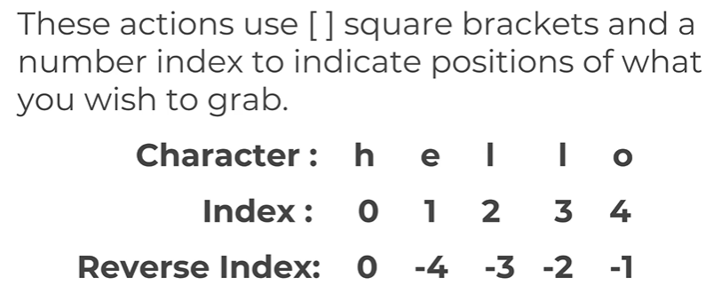

- Python 中的數字與更多應用！在本堂課中，我們將學習 Python 中的數字以及如何操作它們。我們將涵蓋以下主題：
1. Python 中的數字類型基本算術運算
2. 傳統除法 (Classic Division) 與 整數除法 (Floor Division) 的差異
3. Python 中的物件賦值 (Object Assignment)

- 數字類型 (Types of numbers)Python 擁有多種「類型」的數字（數值字面量）。
- 我們主要會聚焦在整數 (Integers) 與 浮點數 (Floating point numbers)。
整數 (Integers)： 就是一般的整數，包含正整數與負整數。例如：2 和 -2 都是整數。
浮點數 (Floating point numbers)： Python 中的浮點數最明顯的特徵就是帶有「小數點」，或者是使用「科學記號 (e)」來定義。例如：2.0 和 -2.1 是浮點數。4E2（代表 $4 \times 10^2$）在 Python 中也是浮點數的一種。在接下來的課程中，我們大多會使用整數或簡單的浮點數。

## 型別定義

| 名稱 (Name) | 縮寫 (Type) | 描述 (Description) | 範例 (Examples) |
| :--- | :--- | :--- | :--- |
| **Integers** | `int` | 整數 | `3`, `300`, `200` |
| **Floating point** | `float` | 浮點數（帶小數點的數字） | `2.3`, `4.6`, `100.0` |
| **Strings** | `str` | 字串（有序的字元序列） | `"hello"`, `'Sammy'`, `"2000"` |
| **Lists** | `list` | 列表（有序的物件序列，可變） | `[10, "hello", 200.3]` |
| **Dictionaries** | `dict` | 字典（無序的 鍵:值 對） | `{"key": "value", "id": 123}` |
| **Tuples** | `tup` | 元組（有序且**不可變**的物件序列） | `(10, "hello", 200.3)` |
| **Sets** | `set` | 集合（無序且**唯一**的物件集合） | `{"a", "b"}` |
| **Booleans** | `bool` | 布林值（邏輯判斷） | `True`, `False` |

## Python 變數命名規則 (Variable Assignment Rules)
- 在 Python 中命名變數時，請務必遵守以下規範：
- 不能以數字開頭： 變數名稱的第一個字元不能是數字（例如：1name 是錯的，name1 才是對的）。
- 不能包含空格： 命名中不可有空格，請使用底線 _ 來連接單字（例如：my_variable）。
- 不能包含特殊符號： 以下符號在變數名中是被禁止的：
`:'",<>/?|\!@#%^&*~-+`
- 遵循 PEP 8 最佳實踐： 根據 Python 的官方風格指南 (PEP 8)，變數名建議使用全小寫字母並以底線分隔（這稱為 snake_case 蛇形命名法）。
- 避免使用內建關鍵字： 不要使用 Python 已經定義好的功能名稱，例如 list 或 str，否則會覆蓋掉原有的功能。
- 避免使用容易混淆的單個字元：
    - 避免使用小寫的 l (L)
    - 避免使用大寫的 O (歐)
    - 避免使用大寫的 I (愛)
- 原因： 因為這些字元在某些字體下看起來非常像數字 1 或 0。題外話，我覺得超靠杯，曾經詐騙集團用 microsoft vs. rnicrosoft 來騙我。
- Dynamic Typing 的優缺點
    - very easy to work with
    - faster development time
    - may result in unexpected bugs!
    - you need to be aware of type()

- Determining variable type with type()
- You can check what type of object is assigned to a variable using Python's built-in type() function. Common data types include:
    - int (for integer)
    - float
    - str (for string)
    - list
    - tuple
    - dict (for dictionary)
    - set
    - bool (for Boolean True/False)

## Python 字串 (Strings)
在 Python 中，字串用來記錄文字資訊（例如：姓名）。

- 核心概念：序列 (Sequence)
Python 中的字串實際上是一個「序列」。這意味著 Python 會按照順序追蹤字串中的每一個元素。例如，Python 會將字串 "hello" 理解為一連串字母的特定組合。因為有了「序列」的概念，我們就能使用索引 (Indexing) 來抓取特定的字母（像是第一個字母或最後一個字母）。「序列」是 Python 中一個非常重要的概念，我們在後續的課程中會不斷遇到它。

本堂課學習重點：
- 建立字串 (Creating Strings)：如何定義字串。
- 列印字串 (Printing Strings)：如何輸出字串內容。
- 字串索引與切片 (String Indexing and Slicing)：如何抓取字串的一部分。
- 字串屬性 (String Properties)：了解字串的特性（例如：不可變性）。
- 字串方法 (String Methods)：使用內建功能來處理字串（如：大小寫轉換）。
- 列印格式化 (Print Formatting)：讓輸出的文字更美觀。



1. 字串是「可變的 (mutable)」嗎？不是！ 
字串在 Python 中是不可變的 (Immutable)。這意味著你一旦建立了字串，就不能直接透過索引來修改其中的某個字元。錯誤嘗試： s = "Hello", s[0] = "W" $\rightarrow$ 這會導致 Python 報錯（TypeError）。解決方案： 如果你想改變字串，你必須建立一個「全新的字串」（例如透過切片與拼接）。
2. 如何在程式碼中加入註解 (Comments)？
你可以使用井字號 #。在 # 後面寫的任何文字，Python 在執行時都會自動忽略。用途： 註解是用來寫給「人」看的，用來解釋為什麼你要這樣寫 code，或者是暫時把某行程式碼「關掉」。

## 三種格式化方法
Python 演進至今共有三種主要的格式化方式，你可能會在別人的程式碼中看到它們：

- % 佔位符 (Oldest Method)：
這是最老派的方法，使用 % 符號。範例："Hello, %s" % name
- .format() 方法 (Improved Technique)：
稍微進化的版本，使用花括號 {} 作為插槽。範例："Hello, {}".format(name)
- f-strings (Newest Method)：Python 3.6 加入的最強大、最推薦的方法，在字串開頭加上 f。範例：f"Hello, {name}"

https://pyformat.info/

- Lists FAQ
1. How do I index a nested list? For example if I want to grab 2 from [1,1,[1,2]]?
You would just add another set of brackets for indexing the nested list, for example: my_list[2][1] . We'll discover later on more nested objects and you will be quizzed on them later!

## Python 字典 (Dictionaries)：映射的概念
我們之前學習的是「序列」，現在要轉換思路，學習 Python 中的 「映射 (Mappings)」。

- 本章節學習重點：
    - 構建字典 (Constructing a Dictionary)：如何建立鍵值對。
    - 從字典中存取物件 (Accessing objects)：如何透過「鍵」找到對應的資料。
    - 巢狀字典 (Nesting Dictionaries)：在字典裡面再放字典。
    - 基礎字典方法 (Basic Dictionary Methods)：例如取得所有的鍵或所有的值。

- 什麼是映射 (Mappings)？
映射是一種透過 鍵 (Key) 來儲存物件的集合。這與「序列」有很大的不同：
    - 序列 (Sequence)：根據物件的 相對位置（索引 0, 1, 2...）來儲存。
    - 映射 (Mapping)：透過 唯一的鍵 來存取資料。

- 重要區別：
由於映射是透過「鍵」來定義物件的，因此它們不一定會保留順序（在舊版 Python 中完全無序，新版雖然看似有序，但邏輯上我們不依賴位置來存取）。

- 字典的組成
一個 Python 字典由一個 鍵 (Key) 和一個 關聯值 (Value) 組成。
    - 鍵：就像標籤（通常是字串）。
    - 值：可以是幾乎任何 Python 物件（數字、字串、列表，甚至另一個字典）。
- Dictionaries FAQ
1. 字典會保持順序嗎？我該如何按順序印出字典的值？
官方回答：
字典屬於 映射 (Mappings)，它們不會保留順序！如果你需要字典的功能，但同時又希望具備排序特性，請參考後續課程中關於 OrderedDict 物件的介紹。Python 3.7+ 之後：Python 官方修改了底層實作，現在的字典會**「記住」你插入資料的順序**。但為什麼教材還說無序？ 因為字典的核心定義是**「透過鍵 (Key) 來尋找值」**，而不是透過「位置」。在寫程式時，如果你依賴 dict[0]（這是錯的）或期待它永遠按特定順序排列，這被視為不專業的作法。

```py
d = {'c': 10, 'a': 50, 'b': 20}

# 想按「鍵」的字母順序印出 (a, b, c)
for key in sorted(d.keys()):
    print(f"{key}: {d[key]}")
```

## Python 元組 (Tuples)
在 Python 中，元組與列表非常相似，但有一個關鍵區別：它們是不可變的 (Immutable)，這意味著一旦建立，就不能更改其中的內容。你通常會使用元組來呈現不應該被修改的資料，例如：一星期中的天數（週一到週日）或日曆上的日期。

- 本章節學習重點：
    - 構建元組 (Constructing Tuples)：學習如何定義元組。
    - 基礎元組方法 (Basic Tuple Methods)：元組能用的方法比列表少很多（因為不能改）。
    - 不可變性 (Immutability)：深入了解為什麼元組不能被修改。
    - 何時使用元組 (When to Use Tuples)：掌握最佳的使用時機。

## Set and Booleans
There are two other object types in Python that we should quickly cover: Sets and Booleans.